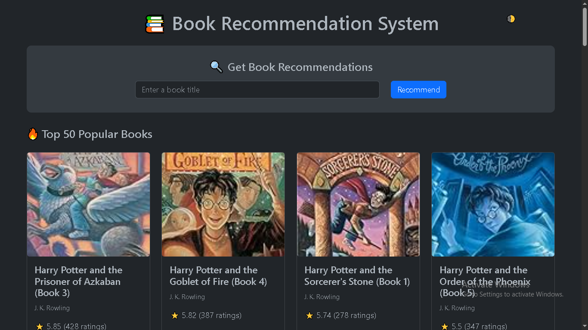
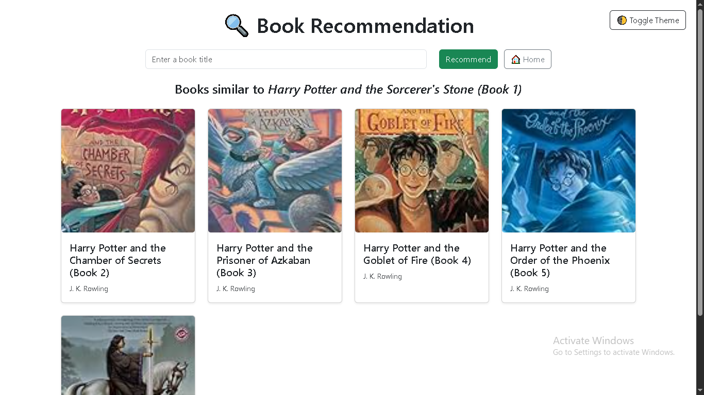

# 📚 Book Recommendation System

A web-based Book Recommendation System built with **Flask**, using real-world data from the [Book-Crossing dataset](http://www2.informatik.uni-freiburg.de/~cziegler/BX/). Users can browse the top 50 most popular books and get 5 personalized book recommendations based on their input.

---

## 🚀 Features

- 🔍 **Book Recommender** – Get 5 similar book suggestions based on your favorite title.
- 📊 **Top 50 Books** – View the most popular books with cover images, ratings, and authors.
- 🌗 **Light/Dark Mode** – Toggle between light and dark themes.
- ✨ **Smooth UI** – Includes animations, hover effects, and responsive design.

---

## 📸 Screenshots

### 🏠 Home Page – Top 50 Books  


### 🔍 Recommendation Page  


> 📌 You can replace these screenshots by capturing them and saving in a `screenshots/` folder.

---

## 🧠 Recommendation Logic

Uses collaborative filtering with a pivot table of user ratings to suggest books based on cosine similarity.

---

## ⚙️ Tech Stack

- Python 3
- Flask
- Pandas, NumPy, Scikit-learn
- Bootstrap 5

---

## 🛠️ How to Run Locally

```bash
# 1. Clone the repo
git clone https://github.com/your-username/book-recommender-flask.git
cd book-recommender-flask

# 2. (Optional) Create a virtual environment
python -m venv venv
venv\Scripts\activate  # On Windows

# 3. Install dependencies
pip install -r requirements.txt

# 4. Run the Flask app
python app.py

# Then open http://127.0.0.1:5000 in your browser
